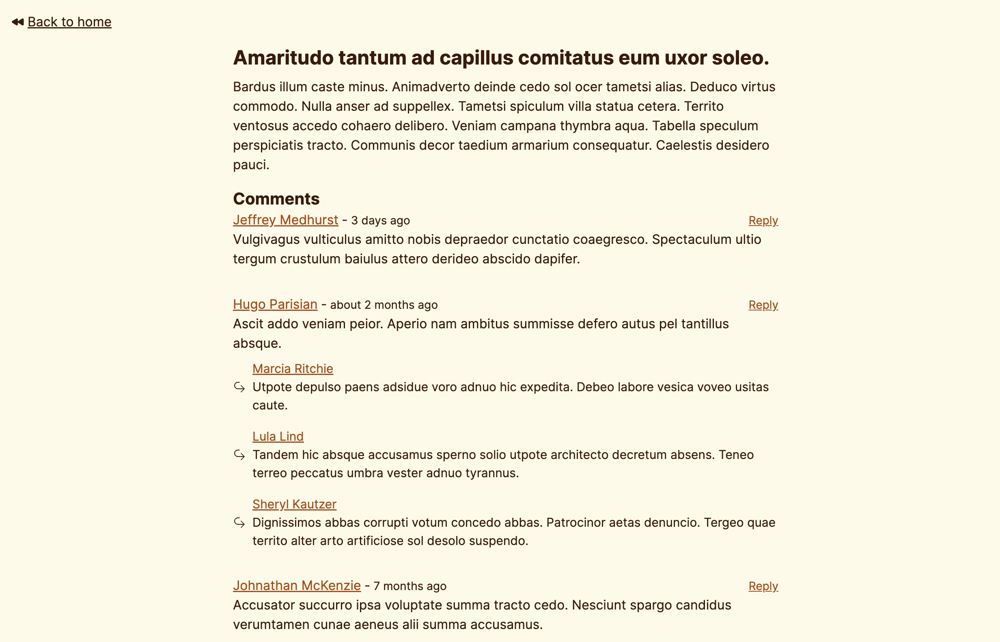

### Composing EdgeDB Queries w/ RSC



> If you want to run locally, jump to [Running Locally](#running-locally)

The goal of this demo is to show Relay-esque style data requirements with a composable query language like EdgeDB.

EdgeDB brings a new level of composability to database querying. If you haven't looked into EdgeDB, I recommend reading the [quickstart here](https://www.edgedb.com/docs/intro/quickstart).

Here's a few code snippets of the composability you can achieve w/ RSCs, bubbling up data requirements of your component tree to the root of your page.

Consider the following EdgeDB Schema

```edgeql
module default {
    type User {
        required name: str;
        required age: int32;

        multi link posts := .<author[is Post];
        multi link comments := .<author[is Comment];
    }

    type Post {
        required title: str;
        required content: str;
        required published: bool;

        required property created_at -> datetime {
            # Set the default value to the current timestamp
            default := datetime_current();
        }

        required author: User;

        multi link comments := .<parentPost[is Comment];
    }

    type Comment {
        required text: str;

        required property created_at -> datetime {
            # Set the default value to the current timestamp
            default := datetime_current();
        }

        parentPost: Post;
        parentComment: Comment;

        required author: User;

        multi link replies := .<parentComment[is Comment];
    }
}
```

```typescript
// page.tsx

export default async function Home() {
  const posts = await e
    .select(e.Post, (post) => ({
      id: true,

      // Look! I can select everything that the PostCard needs.
      // I also get something similar to fragment masking in GraphQL
      // by embedding the PostCard selection in a namespaced object.
      //
      //                     Definition in next example
      //                                |
      //                                |
      postCardRef: e.select(post, PostCardPostRef),

      order_by: {
        expression: post.created_at,
        direction: e.DESC,
      },
    }))
    .run(client);

  return (
    <div className="py-4 px-4">
      <ul className="list-inside space-y-4">
        {posts.map((post) => {
          return (
            <li key={post.id}>
              // And here I can pass the ref to the child component
              <PostCard post={post.postCardRef} />
            </li>
          );
        })}
      </ul>
    </div>
  );
}
```

```typescript
// PostCard.tsx

// This is the equivalent of a Fragment Definition in GraphQL
// Take an arbitary post type, and select what I need off of it
export function PostCardPostRef(post: RefSelectorArg<typeof e.Post>) {
  return {
    id: true,
    title: true,
    content: true,
    author: e.select(post.author, (author) => ({ name: true })),
  } satisfies RefReturnType<typeof e.Post>;
  //               |
  //               |
  //  You'll see this type definition in the next example
}

type PostCardProps = {
  // My prop type is derived by the type and the fragment selection
  //
  //  You'll see this type in the next example
  //       |
  //       |
  post: RefType<typeof e.Post, typeof PostCardPostRef>;
};

export function PostCard({ post }: PostCardProps) {
  return (
    <article className="flex flex-col max-w-2xl mx-auto">
      <Link
        href={`/post/${post.id}`}
        className="text-amber-600 underline visited:text-gray-700"
      >
        <h3 className="font-medium">{post.title}</h3>
      </Link>

      <p className="line-clamp-2">{post.content}</p>
    </article>
  );
}

```

And here are the nasty type definitions to get things to work with the EdgeDB generated TypeScript types.

```typescript
export type RefSelectorArg<Expr extends ObjectTypeExpression> = $scopify<
  Expr["__element__"]
> &
  $linkPropify<{
    [k in keyof Expr]: k extends "__cardinality__"
      ? typeof Cardinality.One
      : Expr[k];
  }>;

export type RefReturnType<Expr extends ObjectTypeExpression> =
  objectTypeToSelectShape<Expr["__element__"]> &
    SelectModifiers<Expr["__element__"]>;

export type RefType<
  Expr extends ObjectTypeExpression,
  Shape extends (
    ...args: any
  ) => objectTypeToSelectShape<Expr["__element__"]> &
    SelectModifiers<Expr["__element__"]>,
> = setToTsType<{
  __element__: ObjectType<
    `${Expr["__element__"]["__name__"]}`, // _shape
    Expr["__element__"]["__pointers__"],
    Omit<normaliseShape<Readonly<ReturnType<Shape>>>, SelectModifierNames>
  >;
  __cardinality__: typeof Cardinality.One;
}>;
```

## Running Locally

```bash
curl --proto '=https' --tlsv1.2 -sSf https://sh.edgedb.com | sh;

git clone git@github.com:tbezman/edgedb-fetch.git;

cd edgedb-fetch;

bun migrate;
bun src/seed.ts;

bun dev; # Start the dev server.
```
