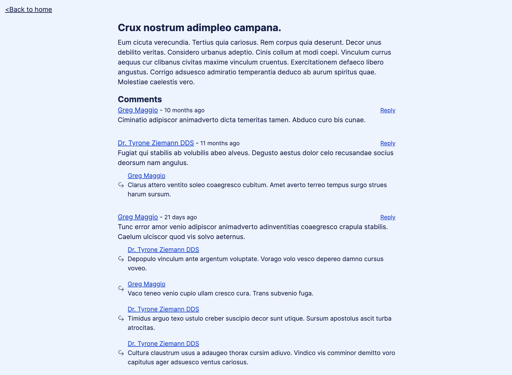

### Composing EdgeDB Queries w/ RSC



> If you want to run locally, jump to [Running Locally](#running-locally)

The goal of this demo is to show Relay-esque style data requirements with a composable query language like EdgeDB.

EdgeDB brings a new level of composability to database querying. If you haven't looked into EdgeDB, I recommend reading the [quickstart here](https://www.edgedb.com/docs/intro/quickstart).

Here's a few code snippets of the composability you can achieve w/ RSCs, bubbling up data requirements of your component tree to the root of your page.

Consider the following EdgeDB Schema

```edgeql
module default {
    type User {
        required name: str;
        required age: int32;

        multi link posts := .<author[is Post];
        multi link comments := .<author[is Comment];
    }

    type Post {
        required title: str;
        required content: str;
        required published: bool;

        required property created_at -> datetime {
            # Set the default value to the current timestamp
            default := datetime_current();
        }

        required author: User;

        multi link comments := .<parentPost[is Comment];
    }

    type Comment {
        required text: str;

        required property created_at -> datetime {
            # Set the default value to the current timestamp
            default := datetime_current();
        }

        parentPost: Post;
        parentComment: Comment;

        required author: User;

        multi link replies := .<parentComment[is Comment];
    }
}
```

```tsx
// page.tsx

export default async function Home() {
  /**
   * This is a fully type safe query fetching all posts from EdgeDB
   *
   * The `...PostCardFragment` bit is a way to tell the query
   * "Please include all of the selections made by the PostCardFragment"
   *
   * You'll see that fragment definition shortly below this code snippet
   *
   * The `@defer` tells the compiler, please split this into a separate query
   * as not to block the initial page load's response time on this fragment's data.
   */
  const { posts } = await edgeql(`
    query PostQuery {
        posts: Post {
          id
          ...PostCardFragment @defer
        }
    }
`).run(client, {});

  return (
    <div className="py-4 px-4">
      <div className="flex items-center justify-between sticky top-4">
        <h1 className="text-2xl font-bold mb-2">Posts</h1>
      </div>

      <ul className="list-inside space-y-4">
        {posts.map((post) => {
          return (
            <li key={post.id}>
              <Suspense fallback={<FallbackCard />}>
                <PostCard postRef={post.PostCardFragmentRef} />
              </Suspense>
            </li>
          );
        })}
      </ul>
    </div>
  );
}
```

```tsx
// PostCard.tsx

import Link from "next/link";
import { edgeql } from "../../dist/manifest";
import { PostCardFragmentRef } from "../../dist/PostCardFragment";

type PostCardProps = {
  postRef: PostCardFragmentRef;
};

export function PostCard({ postRef }: PostCardProps) {
  /**
   * Here we're defining a fragment. A selection of data from the `Post` type.
   *
   * `post` is fully type safe based off the generated `PostCardFragmentRef`
   */
  const post = edgeql(`
    fragment PostCardFragment on Post {
      id
      title
      content
    }
  `).pull(postRef);

  return (
    <article className="flex flex-col max-w-2xl mx-auto">
      <Link
        href={`/post/${post.id}`}
        className="text-blue-600 underline visited:text-gray-700"
      >
        <h3 className="font-medium">{post.title}</h3>
      </Link>

      <p className="line-clamp-2">{post.content}</p>
    </article>
  );
}

export function FallbackCard() {
  return (
    <article className="flex flex-col max-w-2xl mx-auto space-y-1">
      <h3 className="h-5 font-medium bg-blue-100 animate-pulse rounded" />

      <p className="h-12 flex-grow bg-blue-100 animate-pulse rounded"></p>
    </article>
  );
}
```

## Running Locally

```bash
curl --proto '=https' --tlsv1.2 -sSf https://sh.edgedb.com | sh;

git clone git@github.com:tbezman/edgedb-fetch.git;

cd edgedb-fetch;

edgedb project init;

bun migrate;
bun src/seed.ts;

bun compile; # Run the compiler (--watch to run it in watch mode)
bun dev; # Start the dev server.
```
